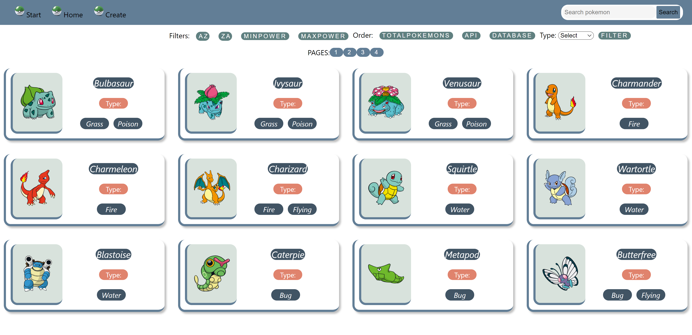

# Individual Project - Pokemon App

  

## Imágenes del proyecto

   

   

## Objetivos del Proyecto

- Construir una App utlizando React, Redux, Node y Sequelize.
- Afirmar y conectar los conceptos aprendidos en la carrera.
- Aprender mejores prácticas.
- Aprender y practicar el workflow de GIT.
- Usar y practicar testing.

## BoilerPlate

El boilerplate cuenta con dos carpetas: `api` y `client`. En estas carpetas estará el código del back-end y el front-end respectivamente.

El contenido de `client` fue creado usando: Create React App.

## Enunciado

La idea general es crear una aplicación en la cual se puedan ver los distintos Pokemon utilizando la api externa [pokeapi](https://pokeapi.co/) y a partir de ella poder, entre otras cosas:

  - Buscar pokemons
  - Filtrarlos / Ordenarlos
  - Crear nuevos pokemons

#### Tecnologías necesarias:
- [ ] React
- [ ] Redux
- [ ] Express
- [ ] Sequelize - Postgres

#### Frontend

Se debe desarrollar una aplicación de React/Redux que contenga las siguientes pantallas/rutas.

__Pagina inicial__: Landing page
- [ ] Imagen de fondo representativa al proyecto
- [ ] Botón para ingresar al home (`Ruta principal`)

__Ruta principal__: 
- [ ] Input de búsqueda para encontrar pokemons por nombre (La búsqueda será exacta, es decir solo encontrará al pokemon si se coloca el nombre completo)
- [ ] Área donde se verá el listado de pokemons. Al iniciar deberá cargar los primeros resultados obtenidos desde la ruta `GET /pokemons` y deberá mostrar su:
  - Imagen
  - Nombre
  - Tipos (Electrico, Fuego, Agua, etc)
- [ ] Botones/Opciones para filtrar por tipo de pokemon y por pokemon existente o creado por nosotros
- [ ] Botones/Opciones para ordenar tanto ascendentemente como descendentemente los pokemons por orden alfabético y por fuerza
- [ ] Paginado para ir buscando y mostrando los siguientes pokemons, 9 pokemons por pagina, mostrando los primeros 9 en la primer pagina.

__Ruta de detalle de Pokemon__: 
- [ ] Los campos mostrados en la ruta principal para cada pokemon (imagen, nombre y tipos)
- [ ] Número de Pokemon (id)
- [ ] Estadísticas (vida, fuerza, defensa, velocidad)
- [ ] Altura y peso

__Ruta de creación__: 
- [ ] Un formulario __controlado__ con los campos mencionados en el detalle del pokemon
- [ ] Posibilidad de seleccionar/agregar más de un tipo de pokemon
- [ ] Botón/Opción para crear un nuevo pokemon

#### Base de datos

- [ ] Pokemon con las siguientes propiedades:
  - ID (Número de Pokemon) * : No puede ser un ID de un pokemon ya existente en la API pokeapi
  - Nombre *
  - Vida
  - Fuerza
  - Defensa
  - Velocidad
  - Altura
  - Peso
- [ ] Tipo con las siguientes propiedades:
  - ID
  - Nombre

#### Backend

Se debe desarrollar un servidor en Node/Express con las siguientes rutas:

- [ ] __GET /pokemons__:
  - Obtener un listado de los pokemons desde pokeapi.
  - Debe devolver solo los datos necesarios para la ruta principal
- [ ] __GET /pokemons/{idPokemon}__:
  - Obtener el detalle de un pokemon en particular
  - Debe traer solo los datos pedidos en la ruta de detalle de pokemon
  - Tener en cuenta que tiene que funcionar tanto para un id de un pokemon existente en pokeapi o uno creado por ustedes
- [ ] __GET /pokemons?name="..."__:
  - Obtener el pokemon que coincida exactamente con el nombre pasado como query parameter (Puede ser de pokeapi o creado por nosotros)
  - Si no existe ningún pokemon mostrar un mensaje adecuado
- [ ] __POST /pokemons__:
  - Recibe los datos recolectados desde el formulario controlado de la ruta de creación de pokemons por body
  - Crea un pokemon en la base de datos
- [ ] __GET /types__:
  - Obtener todos los tipos de pokemons posibles
  - En una primera instancia deberán traerlos desde pokeapi y guardarlos en su propia base de datos y luego ya utilizarlos desde allí

#### Testing
- [ ] Al menos tener un componente del frontend con sus tests respectivos
- [ ] Al menos tener una ruta del backend con sus tests respectivos
- [ ] Al menos tener un modelo de la base de datos con sus tests respectivos
